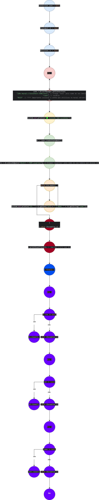

# Como usar
1) instalar o mySQL community
2) Criar um banco de dados
3) necessario o MySQL Connector para rodar
4) verificar dados de conexão como a porta e o nome do servidor nome do usuario e a senha
4) rodar o codigo :)
# Diagramas

# Complexidade Ciclomática:

Nós (N): 26
Arestas (E): 29

V(G) = E - N + 2
V(G) = 29 - 26 + 2 = 5

# Caminhos Básicos

1) 1-2-3-4-5-6-10-11-12-13
2) 1-2-3-4-5-6-7-8-6-10-11-12-13    
3) 1-2-3-4-5-6-7-8-6-7-8-6-10-11-12-13
4) 1-2-9-10-11-12-13
5) 1-2-3-4-5-9-10-11-12-13

# PS: Informações adicionais
Provavelmente eu tenha cometido alguns erros na hora de montar o fluxo de grafo, porque ainda fiquei confuso sobre onde cada trecho começa e termina. Mesmo assim, tentei seguir o que foi pedido.
Gostaria de receber um feedback apontando em quais partes eu errei, para que eu possa melhorar nas próximas atividades.

Além disso, professor, fiquei um pouco confuso com a proposta da tarefa. No enunciado, dizia para montar o fluxo de grafo do código que o senhor forneceu, mas mais abaixo parecia dizer que era para criar um novo código a partir dele e fazer novamente o fluxo de grafo e as demais análises. Fiquei na dúvida se era isso mesmo.

De qualquer forma, acredito que consegui entregar tudo o que foi solicitado.
Aproveito para agradecer — aprendi bastante durante o processo, inclusive sobre Git, mesmo sem ter sido exatamente o foco da atividade kkkkk.